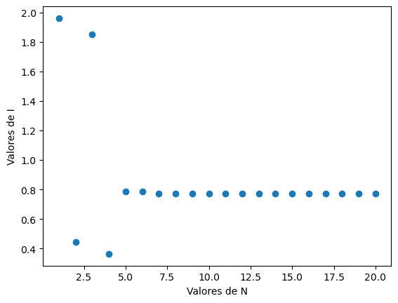

#Calcular la integral $I$

Como se habló en la introducción, la integral de interés es:

$$ \int_0^{\pi} \sin(x^2) dx $$

Primero declaramos las funciones para calcular los valores $x_k$ y $w_k$ de los polinomios de Legendre y sus valores escalados, como visto en [Explicación](explanation.md). Así mismo defínimos la función a integrar.

```python
from scipy.special import legendre
import matplotlib.pyplot as plt
import numpy as np

def gaussxw(N):   #calcular x y w
    x, w = np.polynomial.legendre.leggauss(N)
    return x, w

def gaussxwab(a, b, x, w):   #escalar x y w al intervalo [a,b]
    return 0.5 * (b - a) * x + 0.5 * (b + a), 0.5 * (b - a) * w

def integrando(x):   #funcion a integrar
    return np.sin(x**2)
```
Ahora, en vez de solo integrar una vez para un valor de $N$ concreto, declaramos una funcion que haga el proceso para poder replicar varias iteraciones y graficar el valor de $I$ para varios $N$.

```python
def integral(a, b, funcion, N): #a:inicio, b:final, N: cantidad de segmentos
    x_0, w_0 = gaussxw(N)
    x_N, w_N = gaussxwab(a,b,x_0,w_0)
    return np.sum(w_N*funcion(x_N)) #método de cuadratura gaussiana

print(f"Valor de la integral: {integral(0,np.pi,integrando,20)}")
#Valor de la integral: 0.7726517126900648
```

Ahora, haremos un gráfico que muestre como cambia el valor de la integral según el número de segmentos. Para esto, haremos un *numpy arange* de valores de $N$ del 1 al 20. Luego podemos usar *np.vectorize*. Éste comando recibe una función y admite que entre los argumentos de la función haya *arrays* y nos devuelve un *array* con los resultados de la función. Usaremos éste comando para recibir un valor de $I$ por cada $N$ para poder graficarlos.

```python
valores_N=np.arange(1,21,1,int)
valores_I=np.vectorize(integral)(0,np.pi,integrando, valores_N)

#Hacemos la gráfica I contra N

plt.plot(valores_N, valores_I, 'o')
plt.xlabel("Valores de N")
plt.ylabel("Valores de I")
plt.show()
```



